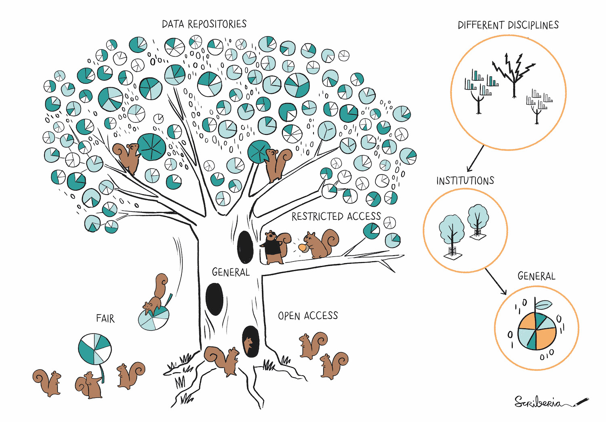

---
# Insert this YAML header (including the opening and closing ---) at the beginning of the document and fill it out accordingly

# We use this key to indicate the last reviewed date [manual entry, use YYYY-MM-DD]
# Uncomment and populate the next line accordingly
date: 2025-05-05

# We use this key to indicate the last modified date [manual entry, use YYYY-MM-DD]
# Uncomment and populate the next line accordingly
date-modified: 2025-09-19

# Do not modify
lang: en
language: 
  title-block-published: "Last reviewed"
  title-block-modified: "Last modified"

# Title of the document [manual entry]
# Uncomment and populate the next line accordingly
title: Publishing data

# Brief overview of the document (will be used in listings) [manual entry]
# Uncomment and populate the next line and uncomment "hide-description: true".
#description: Short description of the document
#hide-description: true

# Authors of the document, will not be parsed [manual entry]
# Uncomment and populate the next lines accordingly
author_1: Elviss Dvinskis
author_2: Selin Kubilay
author_3: Aleksandra Wilczynska

# Maintainers of the document, will not be parsed [manual entry]
# Uncomment and populate the next lines accordingly
maintainer_1: Elviss Dvinskis
#maintainer_2:

# To whom reach out regarding the document, will not be parsed [manual entry]
# Uncomment and populate the next line accordingly
corresponding: Elviss Dvinskis

# Meaningful keywords, newline separated [manual entry]
# Uncomment and populate the next line and list accordingly
categories: 
 - Data
 - Release
 - Publish
 - Archive
 - 4TU
 - Zenodo

---
Data repositories are online locations for storing research data long term. When data is published in a repository, it is (often) assigned a persistent digital object identifier (DOI), which ensures that the data is discoverable and accessible over time. When published, the data should be accompanied by an appropriate license and metadata describing your data. 

:::{.callout-important appearance="simple" icon="false"}
##  Important
- Check the [Write & Publish](https://phdsupervisors.tudl.tudelft.nl/phase/write-publish/) section from the *TU Delft Navigating Research Data and Software: A Practical Guide for PhD Supervisors* guide for more information on publishing your data. It also includes a [list of requirements](https://phdsupervisors.tudl.tudelft.nl/knowledge-base/publishing-requirements-for-data-and-code-for-tu-delft-phd-candidates/?parent_phaseid=0&phaseid=250) for publishing data.
- If you would like to publish your data collection in 4TU.ResearchData or in another data repository, it is advisable that you discuss the publishing process, including the reuse and [citation](https://www.tudelft.nl/en/library/research-data-management/r/publish/cite-your-data) of the original datasets and appropriate [licensing](https://data.4tu.nl/info/en/use/publish-cite/upload-your-data-in-our-data-repository/licencing) options with your faculty [data steward](https://www.tudelft.nl/library/research-data-management/r/support/data-stewardship/contact).
:::

## 4TU.ResearchData

Choosing a repository for publishing your data depends on factors such as storage costs, funding or publication requirements, and security needs. TU Delft provides an in-house data repository, [4TU.ResearchData](https://data.4tu.nl/), supporting versioning and a GitHub remote as part of their services. Additionally, when publishing your data, your submission **is reviewed** to ensure that repository requirements are met. You will receive a DOI for your dataset, which can be used to cite your data in publications. All data **is stored in the Netherlands**, with two locations in Delft and a backup in Leiden.

:::{.callout-note appearance="simple" icon="false"}
##  Learn more
[Getting started with 4TU.ResearchData](https://data.4tu.nl/info/about-your-data/getting-started)
:::

## Zenodo

Developed by CERN, [Zenodo](https://zenodo.org/) is an open repository that allows researchers to upload and share their research outputs, including datasets, publications, and software. Similarly to 4TU.ResearchData you will receive a DOI for your dataset. Zenodo supports versioning and has GitHub integration.

Regardless of the repository you choose, it is important to ensure that your data is properly documented. This includes describing the content, structure, and context of your data, as well as any relevant documentation that is needed to understand and use the data.

:::{.callout-note appearance="simple" icon="false"}
##  Learn more
For a more comprehensive list of repositories and how to select one, you can check the [Turing Way book](https://book.the-turing-way.org/reproducible-research/rdm/rdm-repository) or the [TU Delft Library Guidelines](https://www.tudelft.nl/en/library/research-data-management/r/publish/publish-research-data)
:::