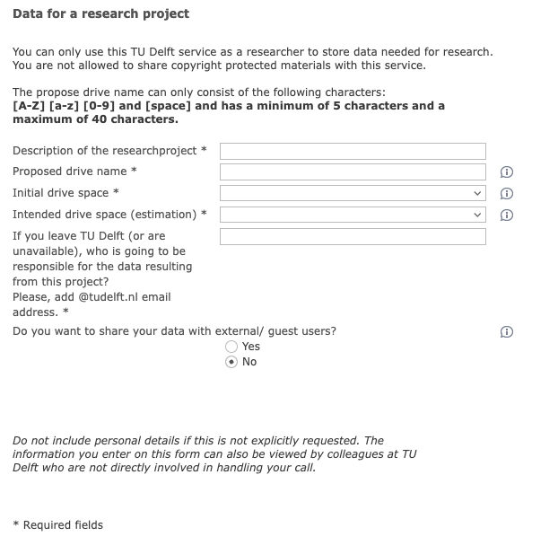

---
# Insert this YAML header (including the opening and closing ---) at the beginning of the document and fill it out accordingly

# We use this key to indicate the last reviewed date [manual entry, use YYYY-MM-DD]
# Uncomment and populate the next line accordingly
date: 2025-07-02

# We use this key to indicate the last modified date [manual entry, use YYYY-MM-DD]
# Uncomment and populate the next line accordingly
date-modified: 2025-07-11

# Do not modify
lang: en
language: 
  title-block-published: "Last reviewed"
  title-block-modified: "Last modified"

# Title of the document [manual entry]
# Uncomment and populate the next line accordingly
title: Accessing and requesting *Project Data Storage* space

# Brief overview of the document (will be used in listings) [manual entry]
# Uncomment and populate the next line and uncomment "hide-description: true".
#description: Short description of the document
#hide-description: true

# Authors of the document, will not be parsed [manual entry]
# Uncomment and populate the next lines accordingly
author_1: Ashley Cryan
author_2: Raúl Ortiz Merino
author_3: Elviss Dvinskis

# Maintainers of the document, will not be parsed [manual entry]
# Uncomment and populate the next lines accordingly
maintainer_1: Raúl Ortiz Merino
#maintainer_2:

# To whom reach out regarding the document, will not be parsed [manual entry]
# Uncomment and populate the next line accordingly
corresponding: Raúl Ortiz Merino

# Meaningful keywords, newline separated [manual entry]
# Uncomment and populate the next line and list accordingly
categories: 
 - data
 - storage

---

## Accessing the *Project Data Storage (U:)* drive 

TU Delft network drives are automatically mounted on TU Delft-managed computers (running Windows) when connected to the TU Delft network (dastud, [eduVPN](https://intranet.tudelft.nl/en/-/openvpn?p_l_back_url=%2Fen%2Fgroup%2Fguest%2Fsearch%3Fq%3Dvpn&p_l_back_url_title=Search)).

On macOS and Linux, there are a few additional steps needed to access *Project Drives*. The instructions can be found [here](https://filelist.tudelft.nl/Calendar/2024/08%20August/Project%20storage%20instructions.pdf). *(Last updated: August 2024)*

It can also be accessed through [webdata.tudelft.nl](https://webdata.tudelft.nl/) using a WebDAV web link [staff-umbrella](https://webdata.tudelft.nl/staff-umbrella). Some systems also support the client [WebDrive](https://webdata.tudelft.nl/). To mount on a TU Delft Virtual Private Server, first follow the instructions [here](/docs/infrastructure/VPS_request.md), and then the instructions in the next guide [Mount *Project Drive* on server](project_drive_mounting.md).

:::{.callout-note appearance="simple" icon="false"}
##  Reminder

If you are accessing the *Project Data Storage (U:)* drive from outside the TU Delft network (e.g., from home), you need to connect to eduVPN beforehand.
:::

## Requesting *Project Data Storage (U:)* space

### Prerequisites
* TU Delft NetID
* (Optional) A list of TU Delft collaborators who should have read/write access to it

### Steps
1. Request the storage via the TU Delft ICT form on TopDesk.
2. Fill out and send the form according to your data storage preferences and requirements.
3. Access your data storage.

#### **Step 1. Request storage via the TU Delft ICT form on TopDesk**
You can make a request for data storage via a form available on the [TopDesk self-service portal](https://tudelft.topdesk.net/) (requires NetID sign-in); navigate to:

Home ⇾ ICT services ⇾ IT for Research ⇾ Data storage for Research: Project data (U:) ⇾ ICT: Request Research Data Storage.

#### **Step 2. Fill out and send the form according to your data storage preferences and requirements**
The form is divided into three sections: "Caller", "Information about requester and data", and "Data for a research project".

The *Caller* section should contain the contact information of the main administrator of this server. If you select your name, the fields below should be auto-populated with your building, phone number, email, department/program, organizational unit, and (sometimes) room.

In the next part, *Information about requester and data*, you choose your preferences about data preservation. The first question asks whether you are setting up new storage or want to change existing storage (or end it). The next questions are about the availability, classification and retention. There are information bubbles next to the choices and clarifications at the beginning of the form.

Lastly, in the section *Data for a research project* you need to provide information about your project. You will need to provide a description of the project, the name of the project, initial and future storage needs, and a corresponding person for handover if you leave TU Delft. Additionally, you have the option to choose whether you want to be able to share the data with external users.

{width=547}

#### **Step 3. Access your data storage**

After submitting the request, you will receive a response from ICT. Once approval is granted, you can access your *Project Data Storage* as described [above](#accessing-the-project-data-storage-u-drive).