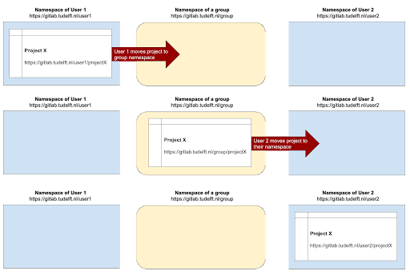
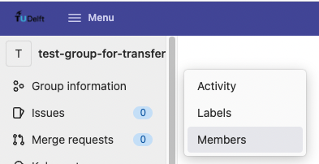
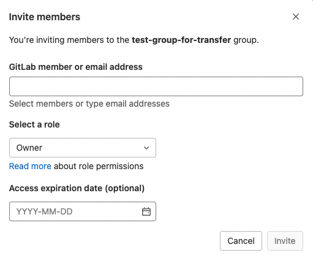
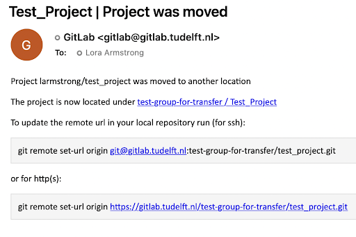
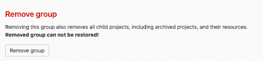

---
# Insert this YAML header (including the opening and closing ---) at the beginning of the document and fill it out accordingly

# We use this key to indicate the last reviewed date [manual entry, use MM/DD/YYYY]
# Uncomment and populate the next line accordingly
#date: MM/DD/YYYY

# We use this key to indicate the last modified date [automatic entry]
date-modified: last-modified

# Do not modify
lang: en
language: 
  title-block-published: "Last reviewed"
  title-block-modified: "Last modified"

# Title of the document [manual entry]
# Uncomment and populate the next line accordingly
title: Transfer ownership of a GitLab repository

# Brief overview of the document (will be used in listings) [manual entry]
# Uncomment and populate the next line and uncomment "hide-description: true".
#description: Short description of the document
#hide-description: true

# Authors of the document, will not be parsed [manual entry]
# Uncomment and populate the next lines accordingly
author_1: Lora Armstrong
author_2: Maurits Kok

# Maintainers of the document, will not be parsed [manual entry]
# Uncomment and populate the next lines accordingly
#maintainer_1: Name Surname
#maintainer_2:

# To whom reach out regarding the document, will not be parsed [manual entry]
# Uncomment and populate the next line accordingly
#corresponding: Name Surname

# Meaningful keywords, newline separated [manual entry]
# Uncomment and populate the next line and list accordingly
#categories: 
# - 
# - 

---

# Transfer ownership of a GitLab repository

## Background

GitLab repositories belonging to employees leaving the TU Delft might be deleted in future. 

From the [TU Delft GitLab help documentation](https://gitlab.tudelft.nl/help#what-happens-to-my-gitlab-projects-when-i-leave), we read the following:

**Current situation**  
_First, if you use Git on your computer, you will have the entire history also locally on your machine. Without a valid TU Delft account, your GitLab access will become inactive. There are currently no plans to delete any content when an account becomes inactive._

**Future situation**  
_At some point in the future, repositories of former TU Delft employees may be deleted. To avoid losing information, it is recommended to transfer ownership of your repositories to a current TU Delft employee when you leave._

## Purpose of this guide

This guide provides the steps required to secure access to repositories of employees who will leave the TU Delft. 

If they have access to your projects, they will still have access after you leave, as long as the projects still exist. You can control who has access to your projects by going to **Project Information > Members** in the sidebar of your repository. To be safe, transfer the ownership of the projects to a current TU Delft employee when you leave.

You can transfer a project to another user’s GitLab namespace. Read what a namespace is [here](https://docs.gitlab.com/ee/user/group/#namespaces).

:::{.callout-note}
Providing a more straightforward way to transfer ownership in GitLab was raised as an issue in 2016 but the issue is still open; you can follow the progress [here](https://gitlab.com/gitlab-org/gitlab/-/issues/14502) if interested.
:::

## Steps

The steps will guide you through transferring repository ownership between TU Delft employees through an intermediary GitLab group:

:::{.callout-note}
Summary (based on this [Stack Overflow post](https://stackoverflow.com/questions/21579693/how-to-change-the-project-owner-in-gitlab)): ​​Move your project from your namespace to a group where both you and the other user are owners, then the other user can transfer it to their own namespace
:::

### Step 1. Create a new group
Create a new group if you don’t have one that you want to use (**Menu > Groups > Create group**)

### Step 2. Invite members
Make sure that both the maintainer of the project repository, and the person who it will be transferred to, are members of the group and have the Owner role (to add a new owner: go to the group namespace, then from the sidebar choose **Group information > Members > Invite members**. 

Enter the username or email of the person you want to invite and change the role to 'Owner'. Click **'Invite'**.)

### Step 3. Transfer project to group
Have a maintainer of the project repository transfer it to the group namespace (go to the project namespace, then from the sidebar go to **Settings > General > Advanced > Transfer Project**)

### Step 4. Check email
After doing this, the maintainer(s) of the project will get an email:

### Step 5. Transfer project to user
Now the person who the project is being transferred to can move it to their own namespace (go to the project namespace, then from the sidebar, go to **Settings > General > Advanced > Transfer Project** like before).

### Step 6. Optional: remove group
If desired, the group can be deleted after the transfer is complete (go to the group namespace, then from the sidebar go to **Settings > General > Advanced > Remove Group**)

