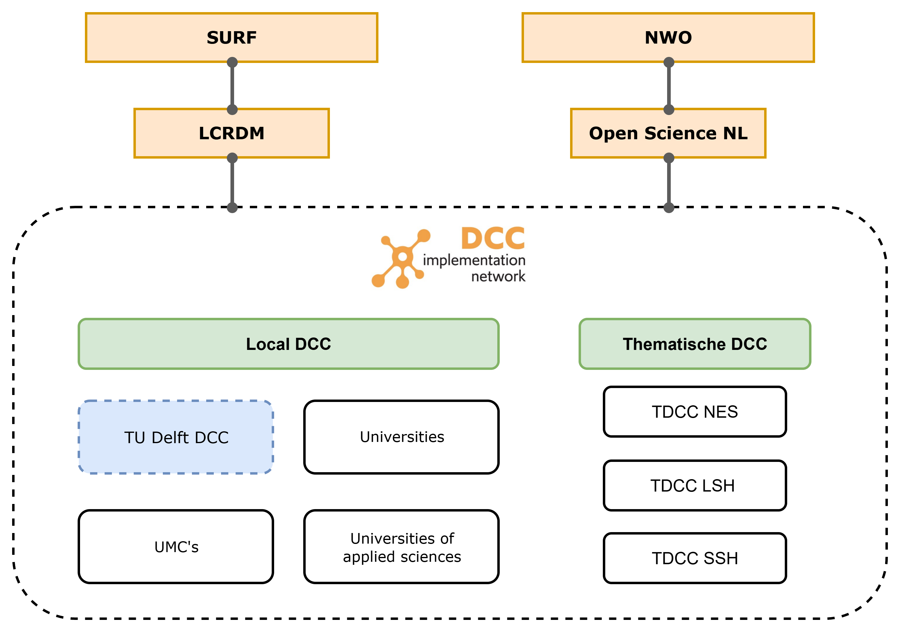

---
# Insert this YAML header (including the opening and closing ---) at the beginning of the document and fill it out accordingly

# We use this key to indicate the last reviewed date [manual entry, use YYYY-MM-DD]
# Uncomment and populate the next line accordingly
date: 2025-12-14

# We use this key to indicate the last modified date [manual entry, use YYYY-MM-DD]
# Uncomment and populate the next line accordingly
date-modified: 2025-12-14

# Do not modify
lang: en
language: 
  title-block-published: "Last reviewed"
  title-block-modified: "Last modified"

# Title of the document [manual entry]
# Uncomment and populate the next line accordingly
title: Contacts & Support Landscape

# Brief overview of the document (will be used in listings) [manual entry]
# Uncomment and populate the next line and uncomment "hide-description: true".
description: TU Delft Partners
hide-description: true

# Authors of the document, will not be parsed [manual entry]
# Uncomment and populate the next lines accordingly
author_1: Aysun Urhan

# Maintainers of the document, will not be parsed [manual entry]
# Uncomment and populate the next lines accordingly
#maintainer_1: Name Surname
#maintainer_2:

# To whom reach out regarding the document, will not be parsed [manual entry]
# Uncomment and populate the next line accordingly
#corresponding: Name Surname

# Meaningful keywords, newline separated [manual entry]
# Uncomment and populate the next line and list accordingly
categories: 
 - Onboarding
 - RSE

---

The Digital Competence Centre collaborates with many partners, both within TU Delft and externally. This document provides an overview of the organizations and initiatives DCC works with regularly. It is intended for TU Delft research support staff and other interested colleagues.

## TU Delft Partners

### Researchers
The TU Delft is a technical university with eight [faculties](https://www.tudelft.nl/en/about-tu-delft/organisation/faculties) and the [QuTech](https://qutech.nl/) Research Institute. The DCC is a central (virtual) team that provides support to all faculties. QuTech is an independent research institute with their own software development team.

- [TU Delft organogram](https://www.tudelft.nl/en/about-tu-delft/organisation)
- [TU Delft Interactive organogram](https://intranet.tudelft.nl/organisatie)
- [About TU Delft](https://www.tudelft.nl/en/about-tu-delft)

### ICT
All Research Software Engineers working in the DCC are employed by ICT Innovation. The department meets regularly to coordinate activities and share expertise. 

#### **Cloud for Research**
Cloud for Research (Cloud4Research) supports researchers in using cloud services for research purposes and serves as a central contact point for cloud-related questions.

- [Cloud4Research](https://tu-delft-ict-innovation.github.io/Cloud4Research/)

### Library 
All Research Data Engineers working in DCC are employed by TU Delft Library.

- [About TU Delft Library organisation](https://www.tudelft.nl/en/library/visit/about-the-library/our-organisation)
- [TU Delft Research Services governance](https://openworking.wordpress.com/2023/05/22/organisation-of-research-services-department-tu-delft-library/) 
- [Copyrights issues](https://www.tudelft.nl/library/copyright)
- [Open Access Publishing](https://www.tudelft.nl/en/library/open-access/open-access-policy-and-guidelines)
- [TU Delft Open Publishing](https://www.tudelft.nl/en/library/current-topics/open-publishing)

The library is a frequent host of events (trainings, meetups, etc.).

#### **RDS team**
RDS focuses on research data management, training, and policy development. The team works closely with other research support units at TU Delft.

### Open Science
Open Science is a key part of TU Delft’s mission to deliver science to society by making scientific knowledge openly accessible and reusable. TU Delft supports researchers in adopting open and FAIR practices.

The DCC was originally part of the FAIR data and software project of the Open Science Program 2020-2024.

- [Organisation](https://www.tudelft.nl/open-science/about/organisation)
- [Position DCC in Open Science](https://www.tudelft.nl/open-science/about/projects/fair-data-and-fair-software)

:::{.callout-tip appearance="simple" icon="false"}
##  The DCC started as a deliverable from the Open Science Program!
:::

### Open Science Community Delft
The Open Science Community Delft supports researchers, educators, students, and support staff in working openly and collaboratively. It is part of the International Network of Open Science and Scholarship Communities (INOSC).

- [Open Science Community Delft website](https://www.tudelft.nl/en/open-science/community)

### Open Hardware
The Open Hardware project promotes open-source hardware within TU Delft by supporting researchers and students and by offering training activities and learning materials.

- [Open Hardware TU Delft](https://www.tudelft.nl/open-science/about/projects/open-hardware)
- [TU Delft | Open Hardware](https://www.tudelft.nl/open-hardware)
- [Open Hardware Academy](https://www.openhardware.academy/01_Welcome.html)

### Delft High Performance Computing Center
The Delft High Performance Computing Center (DHPC) provides advanced computing infrastructure and expertise for TU Delft researchers. It manages DelftBlue, the TU Delft supercomputer.

- [DHPC Homepage](https://www.tudelft.nl/dhpc)
- [Delft Blue Team](https://www.tudelft.nl/dhpc/organisation/team)
- [DelftBlue system information](https://www.tudelft.nl/dhpc/system)
- [Delft Blue documentation](https://doc.dhpc.tudelft.nl/delftblue/)
- [Courses](https://www.tudelft.nl/cse/education/courses)
- [Mattermost channel](https://mattermost.tudelft.nl/dhpc)

### Faculty Data Stewards
TU Delft has appointed a disciplinary data steward at each faculty and a central data stewardship coordinator. Data stewards support researchers directly, develop faculty-specific workflows, and provide training related to data and software management.

- [Data stewards overview and contact information](https://www.tudelft.nl/en/library/data-management/get-support-on-data-management/data-stewardship-at-tu-delft)
- [Faculty data stewards](https://www.tudelft.nl/en/library/research-data-management/r/support/data-stewardship/contact)

### Faculty ICT Managers
Faculty ICT Managers (FIM) act as relationship managers between faculties and Shared Service Center ICT. They advise on ICT-related solutions such as data storage and faculty servers.

- [Faculty ICT Managers information](https://intranet.tudelft.nl/en/-/faculty-it-manager)

### 4TU.ResearchData
4TU.ResearchData is an international data repository for science, engineering, and design, offering services for curation, sharing, long-term access, and preservation of research data. TU Delft hosts the infrastructure and staff for this service.

The DCC is regularly involved in supporting data and software archiving in collaboration with data stewards and contributes to the broader 4TU.ResearchData community.

- [4TU.ResearchData homepage](https://data.4tu.nl/)
- [4TU.ResearchData community](https://community.data.4tu.nl/join-our-community/)

## External Stakeholders

### DCC Implementation Network
All Dutch universities have established a local Digital Competence Centre, which are brought together in the [DCC Implementation Network](https://lcrdm.nl/dcc/). 

:::{.callout-tip appearance="simple" icon="false" collapse="true"}
##  Overview DCC Implementation Network

:::

### Netherlands eScience Center
The Netherlands eScience Center is the national centre for research software expertise, supporting innovative software solutions and training researchers across disciplines.

- [Training materials](https://www.esciencecenter.nl/training-materials/)
- [Events calendar](https://www.esciencecenter.nl/events/)

### NL-RSE
NL-RSE brings together the community of people writing and contributing to research software from Dutch universities, knowledge institutes, companies and other organizations to share knowledge, to organize meetings, and raise awareness for the scientific recognition of research software. The network has been established by the eScience Center in 2017 and has 200+ members from more than 30 institutes across the country.

- [NL-RSE website](https://nl-rse.org/)

### The Carpentries
The Carpentries teach foundational coding and data science skills to researchers worldwide. DCC RSEs and RDEs are trained instructors within the Carpentries community.

- [Training schedule at TU Delft (including Carpentries)](https://www.tudelft.nl/library/data-management/trainingen/trainingen-voor-onderzoekers-en)

### Code Refinery
Code Refinery provides training in essential software and data skills for research and operates as a collaborative training network.

- [Core lessons](https://coderefinery.org/lessons/core/)
- [Code Refinery upcoming workshops](https://coderefinery.org/workshops/upcoming/)

### SURF
SURF is the cooperative association of Dutch educational and research institutions providing shared digital infrastructure and services. SURF hosts the infrastucture of the Dutch supercomputers and offers compute and data services for (inter)national research and education.

- [SURF events and training](https://www.surf.nl/en/agenda/)

### NWO
The Dutch Research Council (NWO) funds and supports scientific research and innovation in the Netherlands. Digital Competence Centers at Dutch universities were initially funded by NWO and continue to be supported through national programmes.

### Thematic Digital Competence Centers
Thematic Digital Competence Centers (TDCCs) support cross-institutional research communities within specific domains. TU Delft participates in the Natural and Engineering Sciences (NES) domain.

- [Life Science & Health (LSH)](https://tdcc.nl/lsh/)
- [Natural and Engineering Sciences (NES)](https://tdcc.nl/nes/)
- [Social Sciences and Humanities (SSH)](https://tdcc.nl/ssh/)
