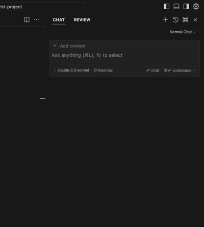
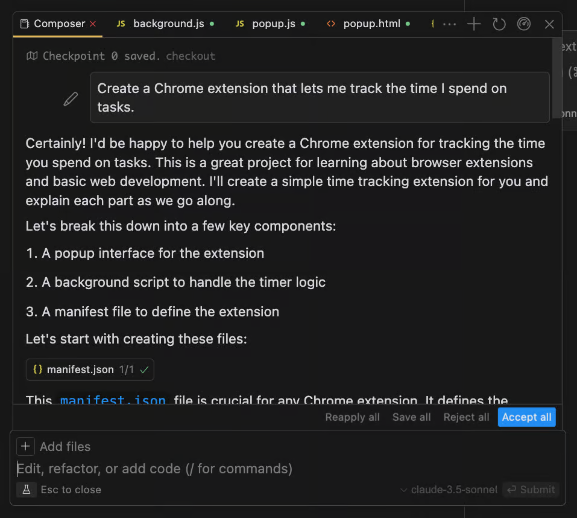
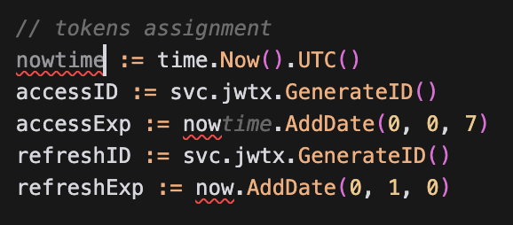

---
# Insert this YAML header (including the opening and closing ---) at the beginning of the document and fill it out accordingly

# We use this key to indicate the last reviewed date [manual entry, use MM/DD/YYYY]
# Uncomment and populate the next line accordingly
date: 01/31/2025

# We use this key to indicate the last modified date [automatic entry]
date-modified: last-modified

# Do not modify
lang: en
language: 
  title-block-published: "Last reviewed"
  title-block-modified: "Last modified"

# Title of the document [manual entry]
# Uncomment and populate the next line accordingly
title: AI Tools and Libraries

# Brief overview of the document (will be used in listings) [manual entry]
# Uncomment and populate the next line and uncomment "hide-description: true".
description: A comprehensive guide to AI-powered development tools and libraries, with detailed instructions on features and commands
hide-description: true

# Authors of the document, will not be parsed [manual entry]
# Uncomment and populate the next lines accordingly
author_1: Nikos Sourlos
#author_2:

# Maintainers of the document, will not be parsed [manual entry]
# Uncomment and populate the next lines accordingly
maintainer_1: Nikos Sourlos
#maintainer_2:

# To whom reach out regarding the document, will not be parsed [manual entry]
# Uncomment and populate the next line accordingly
corresponding: Nikos Sourlos

# Meaningful keywords, newline separated [manual entry]
# Uncomment and populate the next line and list accordingly
categories:
- AI Tools
- Software Development
- IDE
- Productivity
- Code Editing

---

# Introduction
This document provides a detailed overview of various AI tools and their commands, highlighting their features, functionalities, and use cases. Each tool is designed to streamline workflows, enhance productivity, and address specific challenges in tasks ranging from coding and document editing to web scraping and doing research. The commands and features are explained to help users understand their purpose and how to use them effectively.

---

## 1. [Cursor](https://www.cursor.com/)

Cursor IDE is an advanced integrated development environment designed to enhance developer productivity and streamline the coding process. It combines the familiar interface of Visual Studio Code with powerful AI capabilities.

### Features and Commands
- **Normal Chat Window**:  
  - `Command + L` (macOS) / `Ctrl + L` (Windows)  
    Opens a chat interface for interacting with LLMs.

<!-- 
 -->
<!--  -->
<!--  -->


<!--  -->
<!-- 
 -->

<!--  -->

<!-- Source: https://www.thepromptwarrior.com/p/cursor-ai-tutorial-for-beginners -->


- **Inline Editing**:  
  - `Command + K` (macOS) / `Ctrl + K` (Windows)  
    Enables AI code editing directly within files.

  
  
  <!--  -->

    <!--  -->

<!-- Source: https://www.datahackers.news/p/cursor-ai-ferramenta-que-te-permite-desenvolver-software-com-inteligencia-artificial -->

- **Composer**:  
  - `Command + I` (macOS) / `Ctrl + I` (Windows)  
    Opens a structured writing tool for creating formatted outputs, such as documents and tables.

    <!--  -->
    <!--  -->
    


<!--  -->
<!--  -->

<!-- Source: https://www.thepromptwarrior.com/p/cursor-ai-tutorial-for-beginners -->
- **Automatic Code Updates**:  
  - Changes to a variable in one part of the code are automatically propagated to all instances in the codebase.

<!--  -->

<!--  -->

<!--  -->

<!-- SOurce: https://generativeai.pub/cursor-helped-me-get-up-to-speed-with-go-in-just-a-day-7e39d70764c4 -->


- **Markdown Editing**:  
  - Provides robust support for creating structured Markdown documents with headings, lists, and tables.

<!--  -->

---

## 2. [Notebook LM](https://notebooklm.google/)

Google NotebookLM is an innovative AI-powered tool developed by Google Labs, designed to enhance research and note-taking processes. It utilizes advanced language models to assist users by summarizing, explaining, and generating information based on uploaded documents. Users can upload various formats, including Google Docs, PDFs, and audio files, allowing NotebookLM to create customized summaries and insights tailored to specific needs. This tool acts as a virtual research assistant, enabling users to ground the AI in their chosen materials for more relevant and context-aware interactions. An additional feature is the "Audio Overviews" that convert text into engaging audio formats (Podcasts).

### Features
- **Q&A and Multiple-Choice Creation**:  
  Generates questions or quizzes based on provided input, useful for teaching and learning.

- **Document Reading and Notes**:  
  Supports adding notes in complex documents such as research papers.

- **Multiple PDF Handling**:  
  Processes up to 50 PDFs at once, summarizing content or extracting specific details.

- **Podcast Mode**:  
  Converts content into audio summaries with a focus on specific topics or audiences.

- **Sharing**:  
  Allows users to share content or summaries with others.

---

## 3. [Perplexity AI](https://www.perplexity.ai/)

Perplexity AI is an advanced search assistant that focuses on delivering source-based answers and creating visualizations. It excels in scientific research, data-driven insights, and providing transparent, citation-backed results.

### Use Cases
- Ideal for scientific research, providing answers with citations for verification.

### Limitations
- Performs worse than Google in areas like:
  - Live updates
  - Image searches
  - Latency-sensitive queries

---

## 4. AI Web Scraping

AI Web Scraping tools simplify the extraction of data from websites, offering solutions for structured and unstructured content. These tools cater to a variety of scraping needs, from simple pattern-based extraction to advanced fact-checking.

### Tools and Features
- #### **[ScrapeGraph](https://github.com/ScrapeGraphAI/Scrapegraph-ai)**:  
  - Extracts structured data (e.g., JSON) from web pages.  
  - Supports GPT4o-mini for reduced costs.

- #### **[Jina](https://jina.ai/)**:  
  - `r.jina.ai`: Extracts clean text from a URL for LLM compatibility.  
  - `s.jina.ai`: Searches and returns clean results.  
  - `g.jina.ai`: Experimental grounding for fact-checking.
  - Can also be used from the web browser.

- #### **[Crawl4AI](https://github.com/unclecode/crawl4ai)**:  
  - Scrapes websites with predictable URL patterns.  
  - Requires manual data extraction.

- #### **[Firecrawl](https://github.com/mendableai/firecrawl)**:  
  - Extracts pages (and linked pages within them), with a free limit of 500 pages.

- #### **[Screenshot-to-Code](https://github.com/abi/screenshot-to-code)**:  
  - Converts screenshots/video recordings of websites into rendable HTML code.

---

## 5. Other Tools

This section covers a variety of AI tools with unique capabilities, including image analysis, file management, and more. Each tool addresses a specific use case, enhancing workflows for developers, researchers, and content creators.

#### [Vision Agent](https://github.com/landing-ai/vision-agent)
- Analyzes images and generates executable code for problem-solving (e.g., calculating filled area in a jar).

#### [Agent Zero](https://github.com/frdel/agent-zero)
- Combines web search and code execution capabilities.
- Fully transparent thought process, suitable for Docker environments.

#### [GPT Researcher](https://github.com/assafelovic/gpt-researcher)
- Conducts scientific research quickly and cost-effectively.

#### [AI Renamer](https://github.com/ozgrozer/ai-renamer) & [Local File Organizer](https://github.com/QiuYannnn/Local-File-Organizer)
- Renames files based on content and organizes them into categories.

#### [Open Interpreter](https://github.com/OpenInterpreter/open-interpreter)
- Automates tasks like dataset analysis or media editing.
- Requires user approval before execution for safety.

#### [Wispr Flow](https://wisprflow.ai/)
- Provides automatic dictation via voice commands on macOS.

#### [Project Gameface](https://github.com/google/project-gameface)
- Uses facial expressions to control a computer, enhancing accessibility.

#### [Manim](https://github.com/3b1b/manim)
- Creates animations, particularly useful for educational content and mathematical visualizations.

#### [Deepfakes](https://github.com/nsourlos/end-to-end_deepfake_colab) & [AI QR Codes](https://github.com/nsourlos/AI_QR_code)
- Provides tools for generating Deepfakes and AI-powered QR codes.

---


<!-- ## Table of contents
```{tableofcontents}
``` -->
