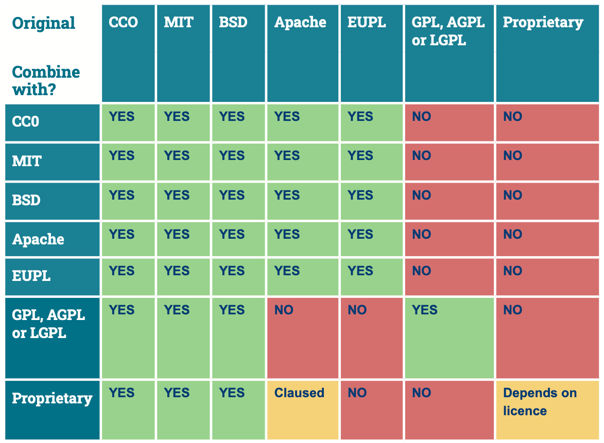

---
# Insert this YAML header (including the opening and closing ---) at the beginning of the document and fill it out accordingly

# We use this key to indicate the last reviewed date [manual entry, use YYYY-MM-dd]
date: 2024-11-14

# We use this key to indicate the last modified date [automatic entry]
date-modified: last-modified

# Do not modify
lang: en
language: 
  title-block-published: "Last reviewed"
  title-block-modified: "Last modified"

# Title of the document [manual entry]
title: Software licenses

# Short description of the document, will be used in the listing
description: Licensing software developed at TU Delft
hide-description: true

# Authors of the document, will not be parsed [manual entry]
author_1: Elviss Dvinskis
author_2: Maurits Kok

# Maintainers of the document, will not be parsed [manual entry]
#maintainer_1:
#maintainer_2:

# To whom reach out regarding the document, will not be parsed [manual entry]
corresponding: Elviss Dvinskis

# Meaningful keywords, newline separated [manual entry]
categories: 
 - documentation
 - FAIR software

---

:::{.callout-important}
## **Important**
For questions about data and software licenses, please consult your [Faculty Data Steward](https://www.tudelft.nl/library/research-data-management/r/support/data-stewardship/contact).
:::

## TU Delft licensing policy
TU Delft, by default, holds the rights to the software created by its employees. In order to apply a **pre-approved open source license**, you have to follow the guidelines in [**TU Delft Guidelines on Research Software: Licensing, Registration and Commercialisation**](https://zenodo.org/records/4629635). It states:

> It is important to remember that in principle TU Delft holds the rights to the software created by its employees (i.e. software developers, researchers and/or staff). So, some formal (legal) steps are needed to arrange matters properly.

> When these guidelines are followed and when the software is published, **TU Delft disclaims its copyright**, allowing software developers, researchers and staff to hold the copyright to their software and thereby having **the right to apply one of the pre-approved licences** when sharing software. The pre-approved open source software licences at TU Delft are Apache, MIT, BSD, EUPL, AGPL, LGPL, GPL, and CC0. 

### Steps to apply a pre-approved open-source license
1. Determine if it is possible to apply an Open Source Software licence to your project (see diagram below).
2. The waiver of TU Delft should be indicated in the software licence with the following text:

```{.markdown .code-overflow-wrap}
Technische Universiteit Delft hereby disclaims all copyright interest in the program “Name program” (one line description of the content or function) written by the Author(s). 

[Name Dean], Dean of [Name Faculty]
```

3. Assert your own, personal copyright (© YEAR, [NAME], [REFERENCE project, grant or study if desired]. The reason for waiving the copyright and having the software developers, researchers and staff file the copyright in their own name facilitates the use of copyleft licences.
4. Apply one of the TU Delft pre-approved Open Source Software licences in the format and form described in the licence text after stating, “This work is licensed under a [NAME and VERSION] OSS licence”.
5. Make the software openly available (for instance in an online repository such as GitHub).
6. Please consider acknowledging support from TU Delft and/or your funding provider.
7. Register the software either in 4TU.ResearchData or in PURE. Registries in 4TU.ResearchData are automatically registered in PURE.

:::{.callout-important}
The steps above are **mandatory**, the TU Delft guidelines state:  

> Please note that if the software is not published, and/or if the guidelines have not been followed correctly and/or if the software is not registered in PURE, then this ‘agreement’ is invalid and the software automatically falls under the legal copyright of TU Delft. This instantly nullifies the right of the software developer or researcher to apply for a licence and thus the open source software licence applied never came into existence. This works retroactively.
:::

### Decision tree for applying for a license
TU Delft staff members can apply for an open-source license according to the decision tree found in [TU Delft Guidelines on Research Software: Licensing, Registration and Commercialisation](https://zenodo.org/records/4629635).

{width=600 .lightbox fig-align="center"}

## Types of open source licenses
- **Permissive licenses aka copyright (e.g., MIT, BSD, Apache):** These licenses allow users to do almost anything with the code, including using it in proprietary software.
- **Restrictive licenses aka copyleft (e.g., GPL, AGPL, LGPL, EUPL):** These licenses require any derivative works to be open source and distributed under the same license.

### Copyright licenses
1. **MIT:** Very simple and permissive, allowing almost unrestricted reuse. The software can be freely used, modified, distributed, and sublicensed. 
2. **BSD:** Similar to the MIT license, but it may include additional attribution requirements.

:::{.callout-note appearance="simple" icon="false" collapse="true"}
###  BSD license details
- ***Attribution:*** Requires that the copyright notice and list of conditions be included in all copies or substantial portions of the software (except for the BSD 0-Clause License, which does not require any attribution). There are different clause variants of the license. For example, a BSD 3-Clause license adds a clause preventing the use of the names of the project or its contributors to endorse or promote derived products without written permission.
- ***Patent Protection:*** Does not include explicit provisions for patent protection.
:::
3. **Apache:** Allows for the use, modification, distribution, and sublicensing of the software under certain conditions. It is often used in open-source projects and is often the choice for its balance between permissiveness and the protection of patents. The Innovation and Impact Center recommends this license for industry collaborations.

:::{.callout-note appearance="simple" icon="false" collapse="true"}
###  Apache license details
- ***Attribution:*** Requires preservation of the original copyright notice and a notice of any modifications made.
- ***Patent Protection:*** Includes a patent retaliation clause, which provides an additional layer of protection. This clause terminates the license if the user initiates patent litigation against any entity regarding the licensed software.
- ***Notice Requirement:*** Modifications to the original code must be documented, and a NOTICE file must be included with any substantial portions of the software.
:::
    
:::{.callout-tip appearance="simple" icon="false"}
###  **Key differences between a BSD and Apache license**
- The Apache license includes a patent retaliation clause to protect against patent litigation, but the BSD license does not explicitly address patent rights.
- The BSD license does not require a specific notice file for modifications, but the Apache License requires a NOTICE file that documents any modifications made to the original code.
:::

### Copyleft licenses
1. **GPL (GNU General Public License):** One of the most widespread copyleft licenses. With the GPL license, any derivative work under this license automatically becomes subject to the same GPL terms, regardless of the size of the contribution. All future modifications and adaptions of code under this license is only compatible with this license and cannot be used in proprietary software.
2. **Derivatives from GPL (AGPL, LGPL, EUPL)**: From these, the EUPL license is somewhat more flexible compared to others as it can coexist with other open-source software licenses such as MIT, BSD, and Apache. For instance, if you integrate a portion of software that is licensed under Apache into a project governed by EUPL, that portion can retain its Apache license. In contrast, under the GPL, the entire codebase would need to be licensed under GPL.

:::{.callout-note appearance="simple" icon="false"}
  There are even instances when GPL licenses are incompatible with each other. For example, GPL-2.0 is incompatible with GPL-3.0. If a project uses GPL-2.0 you are essentially forced to use that license.
:::

### License compatibility
{width=600 .lightbox fig-align="center"} 

:::{.callout-tip appearance="simple" icon="false"}
###  Tip
Don't forget to check whether your software's dependencies have restrictions on re-use.
:::

It is advisable to contact your faculty's data steward regarding licensing questions. If your project involves complex legal considerations, particularly regarding intellectual property rights or compliance with licensing agreements, the Innovation and Impact Center should also be involved.

:::{.callout-note appearance="simple" icon="false"}
##  **Further reading**

- [TU Delft Research Software Policy](https://doi.org/10.5281/zenodo.4629662)
- [TU Delft Guidelines on Research Software](https://zenodo.org/records/4629635) - the TU Delft Research Software Policy approved by the Executive Board
- [Choose a license](https://choosealicense.com) - a simplified guide on choosing an open-source license
- [tl;drLegal](https://www.tldrlegal.com) - Plain English summaries of software licenses
- [The Turing Way - Licensing](https://the-turing-way.netlify.app/reproducible-research/licensing)
:::