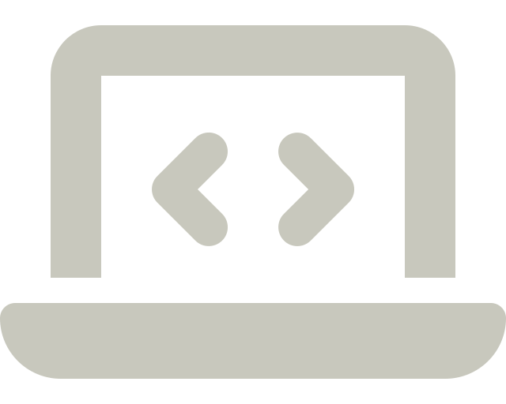
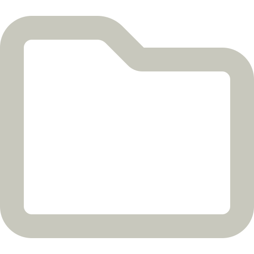

These guides provide a starting point for Research Software, Research Data, and Research Computing at TU Delft. This is an initiative from the TU Delft [Digital Competence Centre](https://www.tudelft.nl/digital-competence-centre).

 Shared solutions for **research support staff** 
 Practical guides for **researchers** 

::: {.grid}

::: {.tool .g-col-lg-2}

<a href="docs/software/getting_started.md" role="button" class="btn btn-outline-light">
  
  
  <strong>Research Software</strong>
</a>

<a href="docs/data/getting_started.md" role="button" class="btn btn-outline-light">
  
  
  <strong>Data Management</strong>
</a>

<a href="docs/infrastructure/getting_started.md" role="button" class="btn btn-outline-light">
  
  
  <strong>Computing Infrastructure</strong>
</a>

<a href="docs/resources/courses.md" role="button" class="btn btn-outline-light">
  
  
  <strong>Courses and Workshops</strong>
</a>
:::

:::

:::{.callout-tip icon="false" appearance="minimal"}
 **Want to get involved?**
 

 [**Join the community**](CONTRIBUTING.md) 
We welcome anyone to join us in improving our guides! Find out how in our [contributing guide](CONTRIBUTING.md).

 [**Join the discussion**](https://github.com/TU-Delft-DCC/TU-Delft-DCC.github.io/discussions) 
We welcome community discussions, ideas, and general questions to develop solutions and receive feedback in our [community forum](https://github.com/TU-Delft-DCC/TU-Delft-DCC.github.io/discussions).

 [**Open an issue**](https://github.com/TU-Delft-DCC/TU-Delft-DCC.github.io/issues/new/choose) 
We track topic requests and bug-reports via GitHub issues.
:::